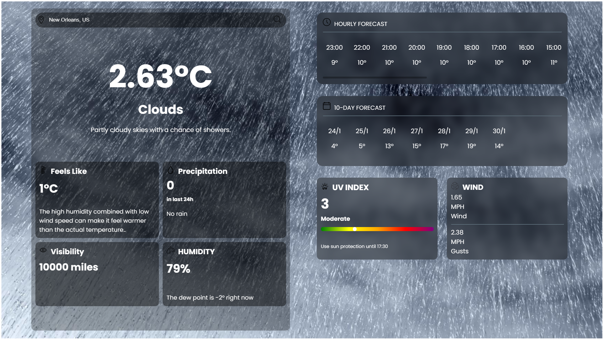

# Weather Forecast

A simple weather application that provides the latest weather information, including temperature, humidity, precipitation, UV index, and wind speed and also provides forecast for the next 10 days.





## Features

- Search for weather information by location
- Display current weather conditions
- Hourly and 10-day weather forecasts
- UV index and wind speed details
- Responsive design for mobile and desktop

## Technologies Used

- HTML
- CSS
- JavaScript

## Getting Started

### Prerequisites

- Web browser (Chrome, Firefox, Safari, etc.)
- IDE or text editor (VS Code, Sublime Text, Atom, etc.)

### Installation

1. Clone the repository:
    ```bash
    git clone https://github.com/Nikhil-818/Weather-Forecast.git
    ```
2. Navigate to the project directory:
    ```bash
    cd weather-app
    ```

### Usage

1. Open `index.html` in your web browser:
    ```bash
    open index.html
    ```
2. Add you Open Meteo API key in `api.js` file.
3. Enter the name of the city you want to search for in the search bar.
4. Click the search button or press Enter to display the weather information.

## Project Structure

- `index.html`: The main HTML file for the application.
- `weather.css`: The CSS file for styling the application.
- `weather.js`: The JavaScript file for application logic.
- `api.js`: The JavaScript file for fetching weather data from the OpenWeatherMap API."
- `assets/`: Directory containing images and other assets.

## Contributing

1. Fork the repository.
2. Create a new branch:
    ```bash
    git checkout -b feature-branch
    ```
3. Make your changes and commit them:
    ```bash
    git commit -m "Description of changes"
    ```
4. Push to the branch:
    ```bash
    git push origin feature-branch
    ```
5. Open a pull request.

## License

This project is licensed under the MIT License. See the `LICENSE` file for details.